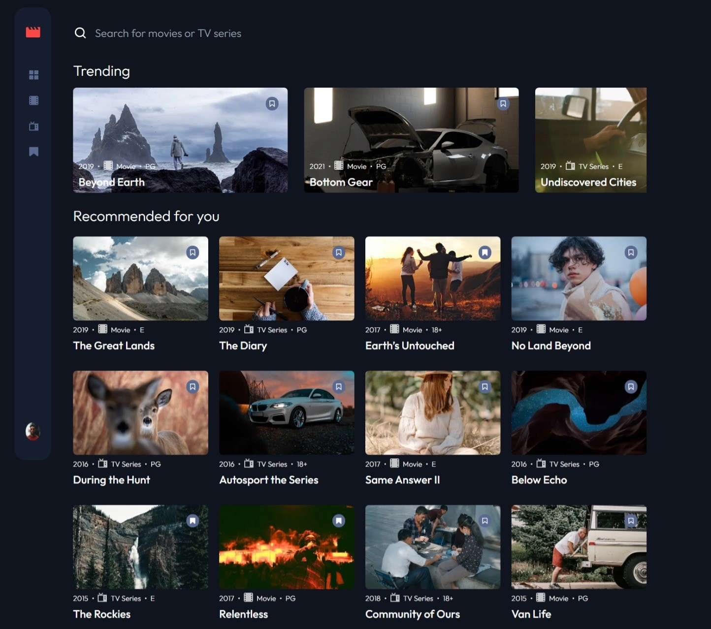

# Frontend Mentor - Entertainment web app solution

This is a solution to the [Entertainment web app challenge on Frontend Mentor](https://www.frontendmentor.io/challenges/entertainment-web-app-J-UhgAW1X). Frontend Mentor challenges help you improve your coding skills by building realistic project.

## Table of contents

- [Overview](#overview)
  - [The challenge](#the-challenge)
  - [Screenshot](#screenshot)
  - [Links](#links)
- [My process](#my-process)
  - [Built with](#built-with)
  - [What I learned](#what-i-learned)
  - [Continued development](#continued-development)
  - [Useful resources](#useful-resources)
- [Author](#author)

## Overview

### The challenge

Users should be able to:

- View the optimal layout for the app depending on their device's screen size
- See hover states for all interactive elements on the page
- Navigate between Home, Movies, TV Series, and Bookmarked Shows pages
- Add/Remove bookmarks from all movies and TV series
- Search for relevant shows on all pages
- **Bonus**: Build this project as a full-stack application
- **Bonus**: If you're building a full-stack app, we provide authentication screen (sign-up/login) designs if you'd like to create an auth flow

### Screenshot

Add a screenshot of your solution. The easiest way to do this is to use Firefox to view your project, right-click the page and select "Take a Screenshot". You can choose either a full-height screenshot or a cropped one based on how long the page is. If it's very long, it might be best to crop it.

Alternatively, you can use a tool like [FireShot](https://getfireshot.com/) to take the screenshot. FireShot has a free option, so you don't need to purchase it. 

Then crop/optimize/edit your image however you like, add it to your project, and update the file path in the image above.

**Note: Delete this note and the paragraphs above when you add your screenshot. If you prefer not to add a screenshot, feel free to remove this entire section.**

### Links

- Solution URL: [Add solution URL here](https://github.com/Dev-Tron/programs-app-main.git)
- Live Site URL: [Add live site URL here](https://your-live-site-url.com)

## My process

### Built with

- Semantic HTML5 markup
- CSS custom properties
- Flexbox
- CSS Grid
- Mobile-first workflow
- [React](https://reactjs.org/) - JS library
- [Next.js](https://nextjs.org/) - React framework
- [Tailwind CSS](https://tailwindcss.com/) - For styles

### What I learned

This project is a full-stack movie and tv show search app that also allows for bookmarking programs. It also comes integrated with a sign-up and log-in form to allow an auth-flow. It took a great deal of trouble to build but it came out ok. It took a while for me to build this because I was learning as I was going. I learnd a great deal from the experience. I used frameworks like Next js and a database manager like prisma to do this. I leanrd alot about error handeling anf more so about the better usage of javascript functions. Further more I learned how to create an auth flow using next auth.

### Continued development

This project is my second to last final project. I will attempt a guru level project now that I have sufficient skills and mastery over these challenges. I will also used the skills that I have leaned towards real world applicaions in the future.

### Useful resources

- [Example resource 1](https://www.prisma.io/) - This is an orm system that I used to set up me database on the backend of my application.
- [Example resource 2](https://next-auth.js.org/getting-started/example) - Using this guide helped me set up the foundations for completing the validations on my login and sign up forms.

## Author

- Website - (https://dev-tron.github.io/portfolio-website/)
- Frontend Mentor - (https://www.frontendmentor.io/profile/Dev-Tron)
- Twitter - (https://www.twitter.com/@BrownKeytron)

